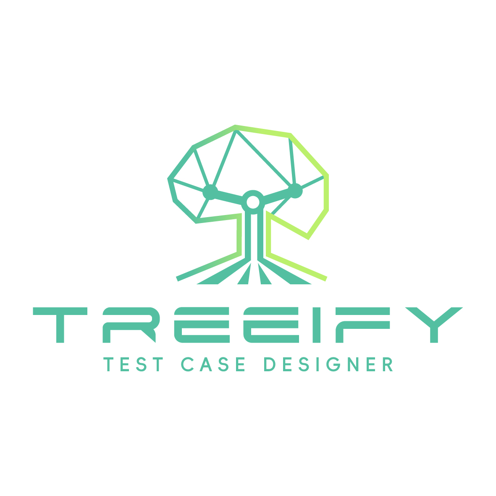

# 🧪 Awesome Test Case Design

Welcome to the **Awesome Test Case Design**! 🎉 This resource is designed to help QA professionals, developers, and tech enthusiasts master the art and science of test case design. Here, you’ll find foundational concepts, advanced techniques, real-world examples, and innovative tools to take your QA skills to the next level.

Our mission is to empower the QA community with actionable knowledge and resources. 🌟

---

## 🚀 Unlock Smarter Test Case Design with Treeify

<div align="center">

</div>

Looking to streamline your test case creation process?  
Our **AI-Powered Test Case Generation Tool** simplifies the entire workflow, from requirement analysis to comprehensive test case creation.

✨ **Key Benefits**:
- Save time with automated test case generation.
- Achieve high test coverage with expert-driven logic.
- Customize test cases for your unique needs.

🔗 [**Discover the Tool Here**](https://treeifyai.com)

💡 This repository complements the tool by offering learning resources to help you understand the principles and techniques behind test case design.

---

## 📖 Table of Contents
1. [📚 Introduction](#-introduction)
2. [🔑 Foundational Concepts](#-foundational-concepts)
3. [💡 Core Test Design Techniques](#-core-test-design-techniques)
4. [🚀 Advanced Test Case Design](#-advanced-test-case-design)
5. [🌍 Real-World Applications](#-real-world-applications)
6. [⚙️ Test Case Optimization](#-test-case-optimization)
7. [🔐 Non-Functional Test Case Design](#-non-functional-test-case-design)
8. [🤖 Automation Integration](#-automation-integration)
9. [⚠️ Edge Case and Negative Testing](#-edge-case-and-negative-testing)
10. [🛠️ Practical Tools and Methods](#-practical-tools-and-methods)
11. [📋 Challenges and Case Studies](#-challenges-and-case-studies)
12. [📈 Testing Trends and Innovations](#-testing-trends-and-innovations)
13. [🌟 Join Our Community](#-join-our-community)
14. [🤝 Contributing](#-contributing)
15. [📜 License](#-license)

---

## 📚 Introduction
- **What is Test Case Design?** 📝  
  Learn why test case design is a critical skill for ensuring high-quality software.
- **Why Good Test Case Design Matters** ⚡  
  Discover how effective test cases improve efficiency, enhance coverage, and foster collaboration.
- **Who is This Repository For?** 👩‍💻👨‍💻  
  Perfect for manual testers, automation engineers, QA leads, and developers of all experience levels.

---

## 🔑 Foundational Concepts
- **[Introduction to Test Case Design: A Beginner's Guide](1.Foundational%20Concepts/Introduction%20to%20Test%20Case%20Design%20-%20A%20Beginner's%20Guide.md)**  
  A starting point for those new to QA, offering insights into what makes a good test case.  
  📚 Includes actionable tips and examples.

- **[Key Elements of an Effective Test Case](1.Foundational%20Concepts/Key%20Elements%20of%20an%20Effective%20Test%20Case.md)**  
  Master the structure and components of clear, reusable, and comprehensive test cases.

- **[Common Mistakes in Test Case Design and How to Avoid Them](1.Foundational%20Concepts/Common%20Mistakes%20in%20Test%20Case%20Design%20and%20How%20to%20Aviod%20Them.md)**  
  Avoid common pitfalls and improve the quality of your test cases with practical advice.

---

## 💡 Core Test Design Techniques
Explore widely used techniques with real-world examples:  
- **[Equivalence Partitioning and Boundary Value Analysis](2.Core%20Test%20Design%20Techniques/Equivalence%20Partitioning%20and%20Boundary%20Value%20Analysis.md)**  
- **[Decision Table Testing](2.Core%20Test%20Design%20Techniques/Decision%20Table%20Testing.md)**  
- **[All-Pairs (Pairwise) Testing](2.Core%20Test%20Design%20Techniques/All-Pairs%20(Pairwise)%20Testing.md)**  
- **[State Transition Testing](2.Core%20Test%20Design%20Techniques/State%20Transition%20Testing.md)**  

---

## 🚀 Advanced Test Case Design
For experienced professionals looking to refine their skills:  
- **[Combinatorial Testing](3.Advanced%20Test%20Case%20Design/Combinatorial%20Testing.md)**  
- **[Test Coverage Strategies](3.Advanced%20Test%20Case%20Design/Test%20Coverage%20Strategies.md)**  
- **[Mutation Testing](3.Advanced%20Test%20Case%20Design/Mutation%20Testing.md)**  

---

## 🌍 Real-World Applications
Discover how to apply test design techniques in specific contexts:  
- **[Designing Test Cases for APIs](4.Real-World%20Applications/Designing%20Test%20Cases%20for%20APIs.md)**  
- **[Designing Test Cases for Mobile Applications](4.Real-World%20Applications/Designing%20Test%20Cases%20for%20Mobile%20Applications.md)**  
- **[Applying Boundary Value Analysis in E-commerce Testing](4.Real-World%20Applications/Applying%20Boundary%20Value%20Analysis%20in%20E-commerce%20Testing.md)**  

---

## ⚙️ Test Case Optimization
Learn how to make your test cases leaner and more effective:  
- **[Test Case Prioritization](5.Test%20Case%20Optimization/Test%20Case%20Prioritization.md)**  
- **[Minimizing Redundancy in Test Suites](5.Test%20Case%20Optimization/Minimizing%20Redundancy%20in%20Test%20Suites.md)**  
- **[Data-Driven Test Case Design](5.Test%20Case%20Optimization/Data-Driven%20Test%20Case%20Design.md)**  

---

## 🔐 Non-Functional Test Case Design
Expand your testing beyond functionality:  
- **[Performance Testing](6.Non-Functional%20Test%20Case%20Design/Performance%20Testing.md)**  
- **[Security Testing](6.Non-Functional%20Test%20Case%20Design/Security%20Testing.md)**  
- **[Usability Testing](6.Non-Functional%20Test%20Case%20Design/Usability%20Testing.md)**  

---

## 🤖 Automation Integration
Bridge the gap between manual and automated testing:  
- **[Translating Manual Test Cases into Automation](7.Automation%20Integration/Translating%20Manual%20Test%20Cases%20into%20Automation.md)**  
- **[Integrating Test Cases into CI/CD Pipelines](7.Automation%20Integration/Integrating%20Test%20Cases%20into%20CICD%20Pipelines.md)**  
- **[Tool-Assisted Techniques for Test Case Design](7.Automation%20Integration/Tool-Assisted%20Techniques%20for%20Test%20Case%20Design.md)**  

---

## ⚠️ Edge Case and Negative Testing
Test for robustness by identifying uncommon but impactful scenarios:  
- **[Why Edge Cases Matter](8.Edge%20Case%20and%20Negative%20Testing/Why%20Edge%20Cases%20Matter.md)**  
- **[Designing Negative Test Cases](8.Edge%20Case%20and%20Negative%20Testing/Designing%20Negative%20Test%20Cases.md)**  
- **[Input Validation Testing](8.Edge%20Case%20and%20Negative%20Testing/Input%20Validation%20Testing.md)**  

---

## 🛠️ Practical Tools and Methods
Optimize your workflow with these innovative methods:  
- **[Using Mind Maps for Test Case Design](9.Practical%20Tools%20and%20Methods/Using%20Mind%20Maps%20for%20Test%20Case%20Design.md)**  
- **[Leveraging AI for Test Case Automation](9.Practical%20Tools%20and%20Methods/Leveraging%20AI%20for%20Test%20Case%20Automation.md)**  

---

## 📋 Challenges and Case Studies
Gain insights from real-world testing scenarios:  
- **[Balancing Depth and Speed in Agile Testing](10.Challenges%20and%20Case%20Studies/Balancing%20Depth%20and%20Speed%20in%20Agile%20Testing.md)**  
- **[Adapting Test Cases for Legacy Systems](10.Challenges%20and%20Case%20Studies/Adapting%20Test%20Cases%20for%20Legacy%20Systems.md)**  
- **[Reducing Test Volume Without Sacrificing Quality](10.Challenges%20and%20Case%20Studies/Reducing%20Test%20Volume%20Without%20Sacrificing%20Quality.md)**  

---

## 📈 Testing Trends and Innovations
Stay ahead with the latest in testing:  
- **[The Future of Test Case Design](11.Testing%20Trends%20and%20Innovations/The%20Future%20of%20Test%20Case%20Design.md)**  
- **[AI and Predictive Analytics in QA](11.Testing%20Trends%20and%20Innovations/AI%20and%20Predictive%20Analytics%20in%20QA.md)**  
- **[Emerging Techniques in Combinatorial Testing](11.Testing%20Trends%20and%20Innovations/Emerging%20Techniques%20in%20Combinatorial%20Testing.md)**  

---

## 🌟 Join Our Community
💬 Join the conversation, share your experiences, and connect with fellow QA professionals!  
We’d love to see you in our **Discord community**: [Click here to join!](https://discord.gg/your-discord-link)

---

## 🤝 Contributing
We welcome contributions! 🛠️ Please read our [contribution guidelines](CONTRIBUTING.md) to learn how to get involved.

---

## 📜 License

This repository is licensed under the **Creative Commons Attribution-NonCommercial 4.0 International License (CC BY-NC 4.0)**.  

### What this means:
- ✅ **You can:**
  - Use, share, and adapt the content for personal or educational purposes.
  - Attribute the repository appropriately when using its content.
- ❌ **You cannot:**
  - Use the content for any commercial or business purposes.
  - Redistribute modified or unmodified versions of this content for profit.

For more details, refer to the [full license text](LICENSE).

---

### 🚀 Next Steps
Clone this repository:  
```bash
git clone https://github.com/Treeify-ai/Awsome-Test-Case-Design.git
```